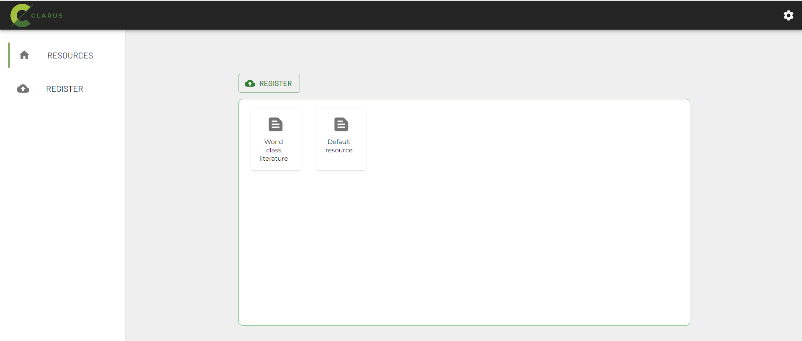
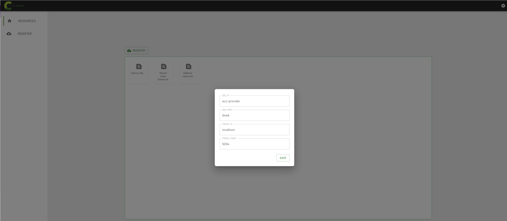
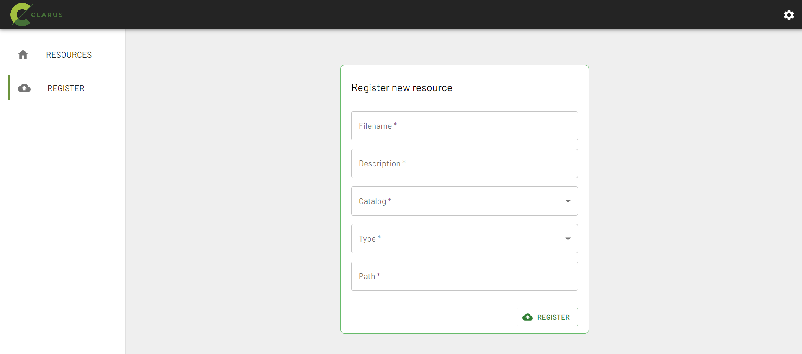

# clarus_edge_deploy

This repository contains the docker-compose and the configuration files needed to deploy the clarus edge services related with the AI lifecycle and data sharing through an IDS clarus dataspace.
Currently, all the services are based on docker images located in public docker registries and in DockerHub project repository.

## Requirements

- Linux machine with Docker version 23.0.5 or above
- Linux machine with Docker-compose version 1.29.2 or above

## Getting started

- Clone this repository.
- Move to the folder clarus_edge_deploy
- Edit .env file and set the PROVIDER_MODEL_CLOUD_IP property with the IP where the aitoolkit connector has been deployed.
- Login in Dockerhub using the clarusproject credentials provided by ENG
- Execute docker-compose file
```
docker-compose up -d
```

## How to use with the example

Once docker-compose is finished, all the containers shall be up and running. To check it, write in terminal type in terminal
```
docker ps -a
```
You shall see the next services:
```
3a1382550dd8   clarusproject/clarus_agent:0.0.1                  "python3 app.py"         8 hours ago      Up 8 hours                  0.0.0.0:8082->8082/tcp                                                   clarus-agent
5484e7090b41   rdlabengpa/ids_uc_data_app_platoon:v1.5           "/bin/sh -c 'java -j…"   8 hours ago      Up 8 hours                  8080/tcp                                                                 uc-dataapp-provider
68ca346d46b4   clarusproject/clarus_hmi:0.0.1                    "docker-entrypoint.s…"   8 hours ago      Up 8 hours                  0.0.0.0:3000->3000/tcp                                                   clarus-hmi
73966fb9cf32   clarusproject/clarus_proxy:0.0.1                  "docker-entrypoint.s…"   8 hours ago      Up 8 hours                  0.0.0.0:5004->5000/tcp                                                   clarus-proxy
c11fa03a88b7   clarusproject/clarus_webserver_data_app:0.0.1     "/bin/sh -c 'java -j…"   8 hours ago      Up 8 hours (unhealthy)      0.0.0.0:8083->8083/tcp, 0.0.0.0:9009->9000/tcp                           be-dataapp-provider
cb760de28c64   clarus_edge_deploy_clarus-inference               "python3 main.py"        8 hours ago      Up 8 hours                  0.0.0.0:7040->7040/tcp                                                   clarus-inference
d60147f60a15   rdlabengpa/ids_execution_core_container:v1.11.0   "/bin/sh -c 'java -j…"   8 hours ago      Up 8 hours (healthy)        0.0.0.0:8086->8086/tcp, 0.0.0.0:8889->8889/tcp, 0.0.0.0:8090->8449/tcp   ecc-provider

```

Use your Internet browser to access Clarus User interface  available at port 3000 
```
http://EdgeDeploy_IP:3000
```



Currently, some configuration settings are needed. Click in the upper right icon and  set the PROXY_IP with the Ip where the edge services have been deployed. THe other parameters must be set as in the image below. IDS_IP=ecc-provider, IDS_PORT=8449 y PROXY_PORT=5004.



Then, click in the resources menu and the resources already registered in the connector will apper in the canvas. By default you will see two resources that will be deleted in later versions.

New resources can be added with the Register menu 



- Filename: Name for the dataset. This name will be used by the AIToolkit to create and train the model and also to register the trainned model in the trainning connector. ()

- Catalog: An IDS connector can have multiple catalogs. It is assumed that the resources will be registered in the default catalogue raised by the connector.

- Type: Select the data source.This version of the edge services expects the datasets to be hosted on web servers. Later versions will be able to access other types of storage. 

- Path: Path of the dataset on the web server.
  
## How to use with the Red wine example

AItoolkit has by default an experiment for wine quality. As an example and to test the complete cycle register-train-download model-execute inference, you can register 
- Filename:Clarus_RedWine_experiment
- Path:http://archive.ics.uci.edu/ml/machine-learning-databases/wine-quality/winequality-red.csv

Once the dataset has been trainned with AItoolkit, you can download the best inference model and execute it making use of Postman tool (a ClarusHE.postman_collection.json & ClarusHE enviroment.postman_environment.json  are provided) or any other Rest Client.

## How to use with it with your own datasets/ models

Trainning Phase:
- Register your own dataset with the help of clarus_hmi
- Train you model with the help of ai-toolkit

Inference execution:
- Remove clarus-inference container
```
docker rm -f clarus-inference
```
- Modify main.py (you can find it in code/clarus_edge_inference in the folder where you have cloned clarus_edge_deploy repository) with your own code to process input data.
- Execute docker compose again
```
docker-compose up -d
```
- Execute inference making use of Postman tool (a ClarusHE.postman_collection.json & ClarusHE enviroment.postman_environment.json  are provided) or any other Rest Client.

## TrueConnector documentation
A complete description of TrueConnector can be found [here](https://github.com/Engineering-Research-and-Development/true-connector)


