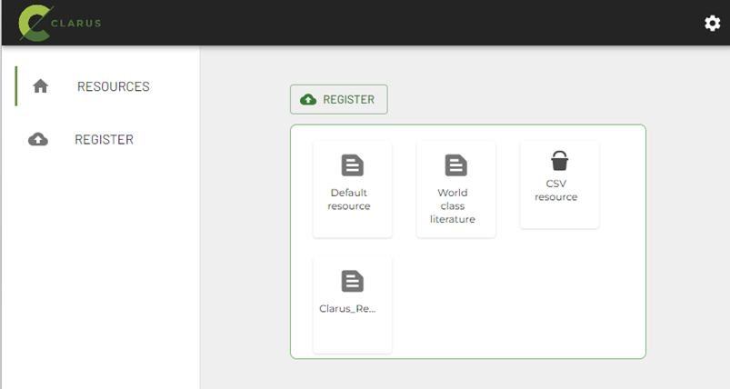
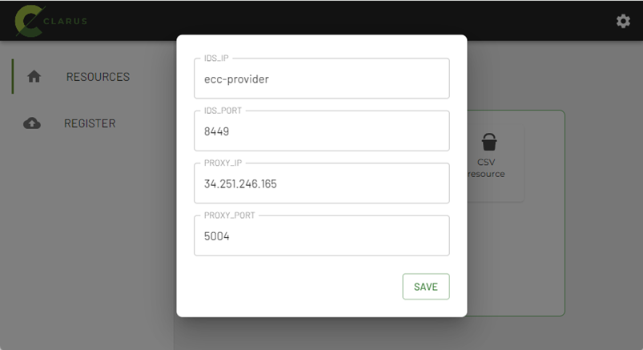

# clarus_edge_deploy

This repository contains the docker-compose and the configuration files needed to deploy the clarus edge data services related with the AI lifecycle and data sharing through an IDS Clarus dataspace.
Currently, all the services are based on docker images located in public docker registries and in DockerHub project repository. The clarus_edge_inference service is not based on an available built image. It has a first implementation that can be used as an example but the service needs to be customized and rebuilt.

## Requirements

- Linux machine with Docker version 23.0.5 or above
- Linux machine with Docker-compose version 1.29.2 or above

## How to deploy

- Clone this repository.Move to the folder clarus_edge_deploy and and configure and execute following next subsections.
### -> Create certificate for DAPS component
If you are using Clarus Dataspace DAPS. You need to create a certificate for the TRueConnector used by the Clarus edge services and configure some settings. DAPS needs a certificate for each participant. The following steps and examples describe the sequence of operations. The names in italics and bold are only as examples.

1.	Create certificate for sharing with DAPS

   

    openssl req -x509 -nodes -newkey rsa:2048 -keyout ***xx-daps-edge***.key -out ***xx-daps-edge***.cert -sha256 -days 365 -subj "/C=***ES***/ST=***Spain***/L=***GI***/O=***IKERLAN***/OU=***IPD***/CN=***xx-daps-edge-cn***” -addtext "subjectAltName = DNS:***your public DNS or IP***" 
    

2.	Send ***xx-daps-edge***.cert to DAPS operator

3.	Generate a .p12 using the key/cert pair you created at step 1, (set a password when prompted) and save it at ecc_cert folder
 
    openssl pkcs12 -export -out ***xx-daps-edge***.p12 -inkey ***xx-daps-edge***.key -in ***xx-daps-edge***.cert -name ***preferred_name***
    

4.	Download public certificate (mvds-clarus.eu.crt) from DAPS operator ( http://daps.mvds-clarus.eu ) 

5.	Import certificates to the truststore at ecc_cert

    
    keytool -import -v -trustcacerts -alias mvds-clarus.eu -file mvds-clarus.eu.crt -keystore truststoreEcc.jks -keypass changeit -storepass allpassword 

    keytool -import -v -trustcacerts -alias ***xx-daps-edge*** -file ***xx-daps-edge***.cert -keystore truststoreEcc.jks -keypass changeit -storepass allpassword 
    

6.	Edit and update. env properties at Clarus edge services folder as follow:
    
    CACHE_TOKEN=true 

    FETCH_TOKEN_ON_STARTUP=true

    CONSUMER_DAPS_KEYSTORE_NAME= ***xx-daps-edge***.p12

    CONSUMER _DAPS_KEYSTORE_PASSWORD= ***password_in_step3***

    CONSUMER _DAPS_KEYSTORE_ALIAS= ***preferred_name_in_step3***
    

7.	Edit and update application-docker.properties at ecc_resources folder as follows:

    ```
    application.isEnabledDapsInteraction=true  
    application.extendedTokenValidation=false 
    application.dapsUrl=https://daps.mvds-clarus.eu/auth/token  
    application.dapsJWKSUrl=https://daps.mvds-clarus.eu/auth/jwks.json 
    ```

### -> Create certificate for MLOps TrueConnector
The TRueConnector deployed at the edge uses TLS certificates to provide or consume data to/from  TRueConnector deployed by the MLOPs cloud platform. It is needed to create a TLS certificate for TrueConnector and import in the truststore the public key of the TRueConnector at MLOps cloud platform. Move to the ecc_folder and recreate certificates. The following steps and examples describe the sequence of operations.  The names in italics and bold are only as examples.

1.	Create public/private key in keystore

    
    keytool -genkey -alias ***xx-tc-edge*** -keyalg RSA -keypass changeit -storepass changeit -keystore ssl-server.jks -ext SAN=ip:***your public IP***, dns:uc-dataapp-provider,dns:ecc-provider,dns:be-dataapp-provider 
    
2.	Export certificate

    
    keytool -export -alias ***xx-tc-edge***  -storepass changeit  -file ***xx-tc-edge***.cer -keystore ssl-server.jks 
    

3.	Import own certificate in truststore

    
    keytool -import -v -trustcacerts -alias ***xx-tc-edge*** -file ***xx-tc-edge***.cer -keystore truststoreEcc.jks -keypass changeit -storepass allpassword 
    

4.	Edit and update. env properties at Clarus edge services folder with the Alias certificate you have used

    
    ALIAS= ***xx-tc-edge*** 
    

5.	Get TRueConnector public certificate from  MLOps cloud platform 

6.	Import in your truststore
    
    keytool -import -v -trustcacerts -alias ***xx-tc-mlops*** -file ***xx-tc-mlops***.cer -keystore truststoreEcc.jks -keypass changeit -storepass allpassword
    

### -> Configure enviroment properties

Move to the folder where the repo has been cloned. Edit .env file and update next settings.

1. TrueConnector model provider host machine. PROVIDER_MODEL_CLOUD_IP: IP where the MLOps platform has deployed the model provider. PROVIDER_MODEL_CLOUD_PORT doesn´t need to be updated.
    ```
    # TRueConnector model provider host machine
    PROVIDER_MODEL_CLOUD_IP=XXX.XXX.XXX.XXX
    PROVIDER_MODEL_CLOUD_PORT=8890
    ```

2. Dataset storage configuration. Currently only two options are available:

   - http webserver (credentials are not supported) doesn´t need any configuration 
   - MinIO server. You need to configure the server IP and the credentials
   
    ``` 
    # minio configuration
    MINIO_URI=http://XXX.XXX.XXX.XXX:port
    MINIO_USERNAME=<username>
    MINIO_PASSWORD=<password>
    ```


### -> Execute services

- Login in Dockerhub using the clarusproject credentials provided by ENG
    ```
    docker login -username=clarusproject
    ```

- Execute docker-compose file
    ```
    docker-compose up -d
    ```
- Once docker-compose is finished, all the containers shall be up and running. To check it, write in terminal type in terminal
    ```
    docker ps -a
    ```
You shall see next services up:


## How to use 

Once all the services are configured and running, the user can start using them. The sequence of operations are described in the next subsections:

### -> Register Dataset

First the dataset to be trainned and tracked  by the MLOps platform needs to be selected and registered as a resource in the TRueConnector at edge. The user interface offered in port 3000 helps with this task. Access port 3000 in the host where you have deployed the edge services. You will see the next screen.




Currently, some configuration settings are needed. Click in the upper right icon and  set the PROXY_IP with the Ip where the edge services have been deployed. THe other parameters must be set as in the image below. IDS_IP=ecc-provider, IDS_PORT=8449 y PROXY_PORT=5004.



Then, click in the resources menu and the resources already registered in the connector will apper in the canvas. By default you will see two resources that will be deleted in later versions.

New resources can be added with the Register menu 


- Filename: Name for the dataset. This name will be used by the AIToolkit to create and train the model and also to register the trainned model in the trainning connector. ()

- Catalog: An IDS connector can have multiple catalogs. It is assumed that the resources will be registered in the default catalogue raised by the connector.

- Type: Select the data source.This version of the edge services expects the datasets to be hosted on web servers or MinIO servers. 

- Bucket: If using MinIO server, bucket where dataset is located.
- Path: Dataset path. 
  

### ->Transform, train and track inference model using MLOps platform

Once the model developer has uploaded the pipeline to the MLOps cloud platform and the data provider has shared the expected data for training, the pipeline can be executed. Currently, the trigger of a training execution requires access to the Airflow frontend and is executed by the MLOps cloud platform provider. This execution could also be triggered from the edge to force a retraining, but this operation is not yet integrated with the concept drift detection service.


### ->Download best inference model

The Clarus agent provides an endpoint to consume the best model inference trained by the MLOPs cloud platform. Previously this model must have been registered as a resource in the TRueConnector deployed at the MLOps cloud platform.
The user can trigger the download or update the best inference model for a dataset making a PUT request to the port 8082
```
    http://IP:8082/clarus/v1/agent/modelinference/{Dataset}
```
IP: IP where the Clarus edge service have been deployed.
{Dataset}: Name of the trained model registered in TRueConnector at the MLOps cloud platform.

Once the model consumption process between the connectors is complete, the model and additional files stored by MLFlow will be downloaded and stored on the edge in a docker volume shared between the Clarus agent and Inference execution engine services.

### -> Execute inference model at edge
Before executing the inference execution engine it is necessary to customise this service. At the moment, the service only has a rest API that triggers the inference execution but this code is empty and only contains a template that needs to be implemented by someone with knowledge of the features of the downloaded inference model. The next steps are to stop the container for this service.
```
    docker compose stop clarus-inference
```

Implement the code and update the requirements.txt file with the libraries needed to run the model. Re-launch the service by running docker compose.

```
    docker compose up -d
```
The inference engine image will be rebuilt and ready to be used. The user can execute the inference making a GET request to the port 7040.

```
    http://IP:7040/predict_3?modelId={Dataset}&datos={datos} 
```
IP: IP where the Clarus edge service have been deployed

{Dataset}: Name of the trained model registered in TRueConnector at the MLOps cloud platform and already downloaded on the edge.

{datos}: Collection of data inputs as expected by the model inference preprocessing


## TrueConnector documentation
A complete description of TrueConnector can be found [here](https://github.com/Engineering-Research-and-Development/true-connector)


